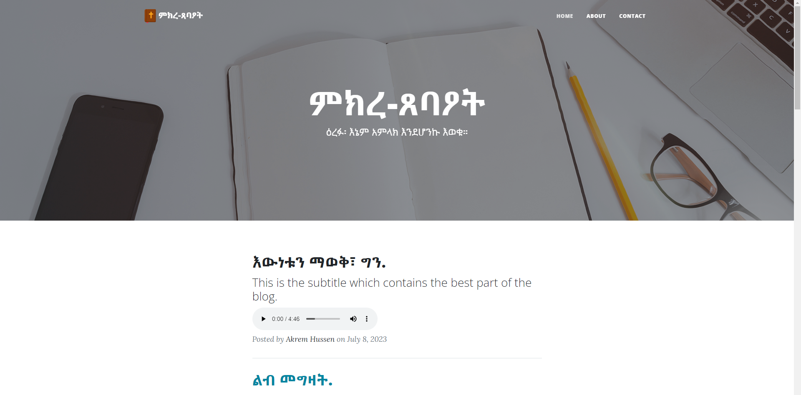

<h1> BLOG APPLICATION </h1>

 This is a blog application, The system fetches data from telegram using node-telegram-bot-api package in node. To get the backend of this project use the link below. 

<a href="https://github.com/Milli-saved/serverForBlogApp">Link to Backend.</a>

<a href="https://blog-101-nine.vercel.app/">Live Preview</a>

# Version 1.0.0 - 05-19-2023

- Updated : All Project Dependencies
- Updated : Code Structure

<h2> Getting Started </h2>

 In Project directory, you can run: 

<h3> <code> npm start </code> </h3>

 Runs the app in the development mode. 
Open <a href="http://localhost:3000">http://localhost:3000</a> to view it in the browser. 

<h3 id="npmrunbuild"><code>npm run build</code></h3>

Builds the app for production to the <code>build</code> folder. 
It correctly bundles React in production mode and optimizes the build for the best performance.

<h3>For questions and support mail  at <a href="mailto:million12.tenkir@gmail.com">Million Tenkir</a></h3>
